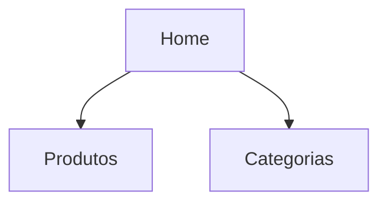
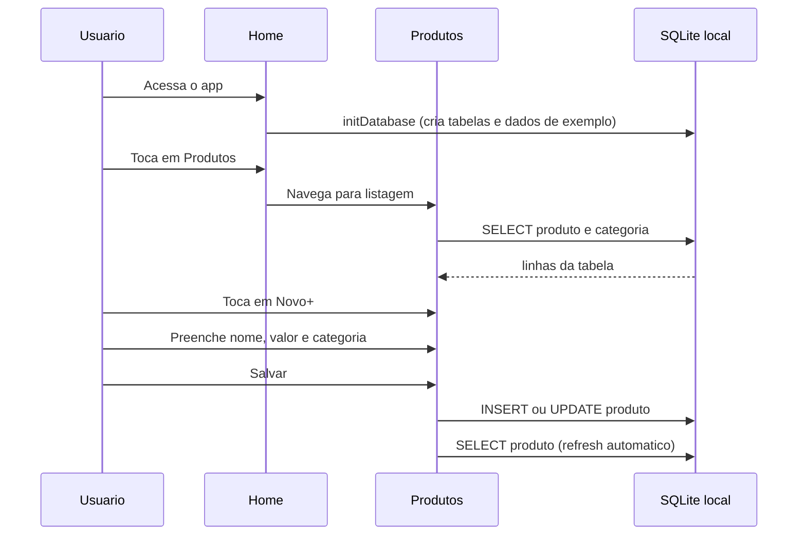

# IntegracaoSQL


Aplicativo mobile desenvolvido com Expo e React Native para gerenciamento de produtos e categorias, com navegacao tipada, interface minimalista padronizada e fluxo de cadastro/listagem organizado por modulos.

## Visao Geral

O projeto oferece uma estrutura clara para operacoes de catalogo com foco em usabilidade:

- Home com acesso direto aos modulos principais
- Gestao de produtos com formulario inline, selecao de categoria e exclusao com confirmacao
- Gestao de categorias com acoes de criacao, edicao e exclusao na listagem
- Persistencia local em SQLite (via `expo-sqlite`), com dados de exemplo pre-cadastrados,
  indicador de carregamento e erros visiveis na tela

## Stack Tecnologica

- Expo 54
- React 19
- React Native 0.81
- TypeScript (modo strict)
- React Navigation Native Stack
- expo-sqlite (banco de dados local)

## Arquitetura de Navegacao



## Fluxo Funcional



## Estrutura do Projeto

```text
integracaoSQL/
|-- App.tsx
|-- index.ts
|-- app.json
|-- package.json
|-- tsconfig.json
|-- assets/
|   |-- adaptive-icon.png
|   |-- favicon.png
|   |-- icon.png
|   |-- splash-icon.png
|-- src/
|   |-- api/
|   |   |-- api.ts
|   |-- database/
|   |   |-- db.ts
|   |-- models/
|   |   |-- CategoriaModel.ts
|   |   |-- ProdutoModel.ts
|   |-- screens/
|       |-- home/
|       |   |-- index.tsx
|       |-- produtos/
|       |   |-- index.tsx
|       |-- categorias/
|           |-- index.tsx
```

## Modulos de Tela

| Tela | Papel no sistema |
|---|---|
| Home | Centraliza a navegacao entre Produtos e Categorias |
| Produtos | Lista, cria, edita e exclui produtos; seleciona categoria via picker |
| Categorias | Lista, cria, edita e exclui categorias |

## Padrao Visual

O app adota uma linha minimalista e consistente:

- Fundo claro neutro
- Cartoes com borda suave
- Botoes principais escuros com alto contraste
- Tipografia com hierarquia simples
- Campos de formulario alinhados e uniformes

## Configuracao e Execucao

### Requisitos

- Node.js LTS
- npm
- Expo Go no celular ou emulador Android/iOS

### Instalacao

```bash
npm install
```

### Execucao

```bash
npm run start
```

Comandos adicionais:

```bash
npm run android
npm run ios
npm run web
```

## Persistencia Local (SQLite)

O app nao depende de nenhuma API externa: todos os dados ficam em um banco SQLite local,
criado automaticamente pelo `expo-sqlite` na primeira execucao.

- `src/database/db.ts` abre o banco `integracaoSQL.db`, cria as tabelas `categoria` e
  `produto` (se nao existirem) e, caso a tabela `categoria` esteja vazia, insere alguns
  registros de exemplo (categorias "Bebidas", "Alimentos", "Limpeza" e produtos
  associados).
- `src/api/api.ts` expoe os objetos `categoriaApi` e `produtoApi`, cada um com `getAll`,
  `getById`, `create`, `update` e `remove`, todos executando consultas SQL diretamente no
  banco local.

### Tabelas

| Tabela | Colunas |
|---|---|
| categoria | `id_categoria` (PK, autoincrement), `dc_categoria` |
| produto | `id_produto` (PK, autoincrement), `dc_produto`, `vl_produto`, `id_categoria` |

### Passo a passo

1. Instale as dependencias com `npm install`.
2. Inicie o app com `npm run start` (ou `npm run android` / `npm run ios`).
3. No primeiro carregamento, `App.tsx` chama `initDatabase()` e exibe um
   `ActivityIndicator` ate o banco estar pronto.
4. Abra as telas **Categorias** e **Produtos** — os dados sao carregados automaticamente
   via `useEffect` ao entrar na tela, com `ActivityIndicator` durante o carregamento.
5. Use o botao **Novo +** para abrir o formulario inline, **Editar**/**Excluir** em cada
   item, e a lista e recarregada automaticamente apos qualquer operacao.

### Observacoes

- Por ser um banco local, os dados persistem entre execucoes do app no mesmo
  dispositivo/emulador, mas nao sao compartilhados entre dispositivos diferentes.
- Caso alguma operacao no banco falhe, a mensagem aparece em destaque no topo da tela
  (texto vermelho), sem travar a interface.

## Scripts

| Script | Comando |
|---|---|
| start | expo start |
| android | expo start --android |
| ios | expo start --ios |
| web | expo start --web |

## Qualidade Tecnica

- Tipagem de rotas com RootStackParamList
- TypeScript em strict mode
- Separacao por modulos de tela
- Organizacao de estilos por componente
